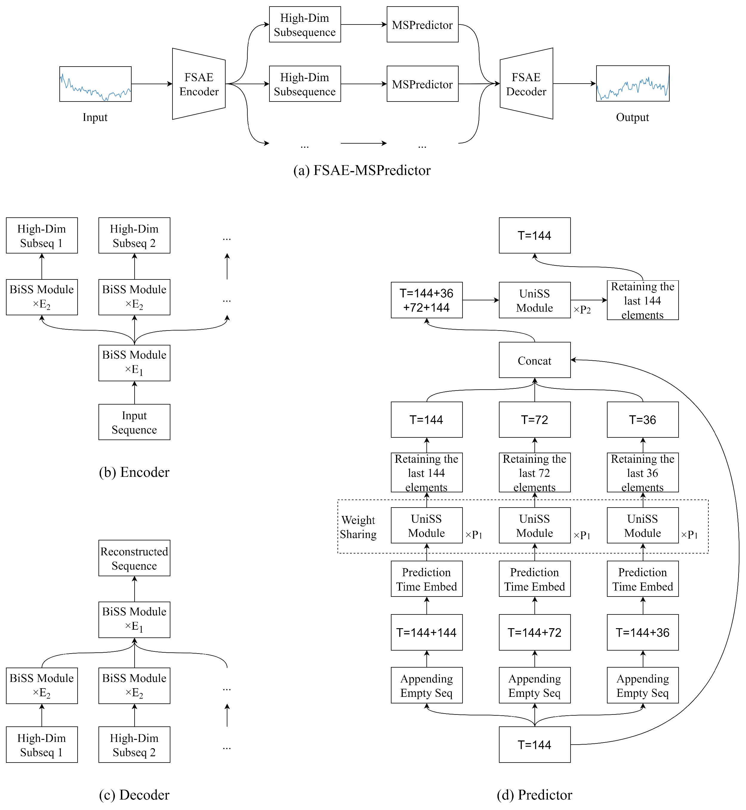

# FSAE-MSPredictor: Spectral-Discrepancy-Guided High-Dimensional Decomposition for Wind Speed Forecasting

## Overview

We propose the FSAE-MSPredictor, a novel wind speed forecasting model.



## Installation

```
conda env create -f environment.yml
conda activate FSAE-MSPredictor
pip install https://github.com/state-spaces/mamba/releases/download/v1.2.0.post1/mamba_ssm-1.2.0.post1+cu118torch1.12cxx11abiTRUE-cp39-cp39-linux_x86_64.whl
```

## Datasets

Penmanshiel: https://zenodo.org/records/8253010

SDWPF: https://aistudio.baidu.com/competition/detail/152/0/introduction

## Acknowledgments

Our code is based on [OpenSTL](https://github.com/chengtan9907/OpenSTL). We sincerely appreciate for their contributions.